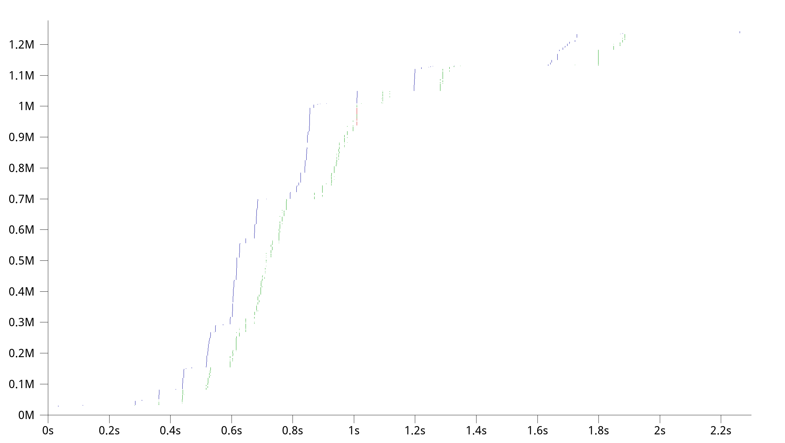

# h2olog-quic-trace

A utility to prepare log data for `google/quic-trace`.

## Prerequisites

* Python 3.5 or later
  * and its dependencies: `pip3 install -r requirements.txt`
* A BigQuery authentication file named `authn.json`
  * See https://cloud.google.com/bigquery/docs/reference/libraries to setup authentication
* A BigQuery table managed by `h2olog-collector`
  * See https://github.com/gfx/h2olog-collector for details

## Usage

### Fetch a specific set of logs from BigQuery

Assumed that there is a BigQuery table named `h2olog.quic`:

```console
# find by xid
$ h2olog-quic-trace 'h2olog.quic' --xid 123456 > log.jsonl

# find by quicly connection id
$ h2olog-quic-trace 'h2olog.quic' --conn 123456 > log.jsonl
```

### Transform `.jsonl` into QTR JSON files

```console
$ $QUICLY/misc/quictrace-adapter.py log.jsonl qtr
Transforming qtr/2020-04-20T13:24:49Z-250194.json
```

where `$QUICLY` is the `h2olog/quicly` repository path.

### Render a QTR JSON file

```console
$ $QUIC_TRACE/bazel-bin/tools/render/render_trace qtr/2020-04-20T13:24:49Z-250194.json
```

where `$QUIC_TRACE` is the `google/quic-trace` repository path.

Then, you'll see a QUIC trace viewer launched like this:



## See Also

* https://github.com/h2o/h2o
* https://github.com/h2o/quicly
* https://github.com/toru/h2olog
* https://github.com/gfx/h2olog-collector
* https://github.com/google/quic-trace